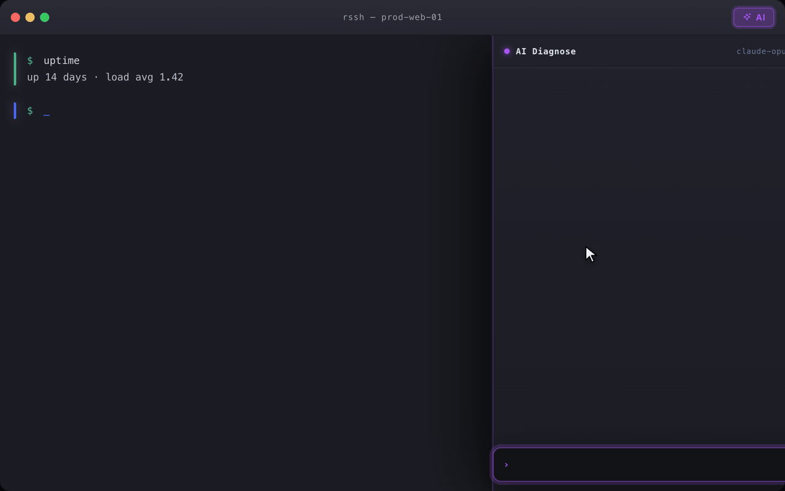
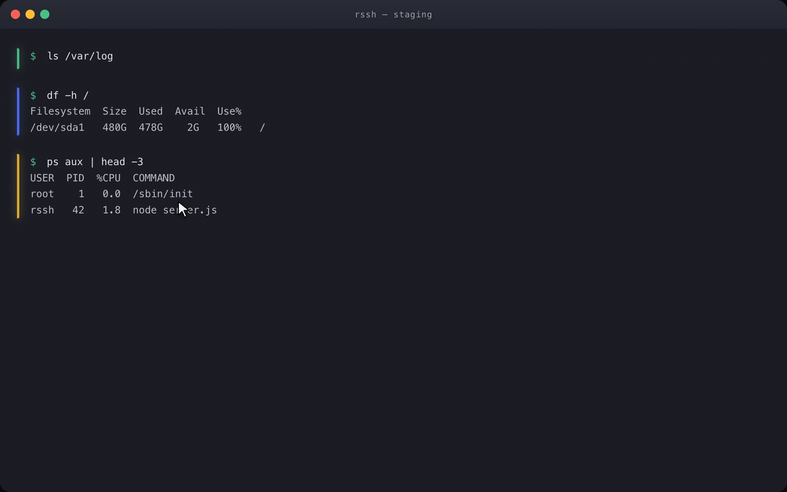
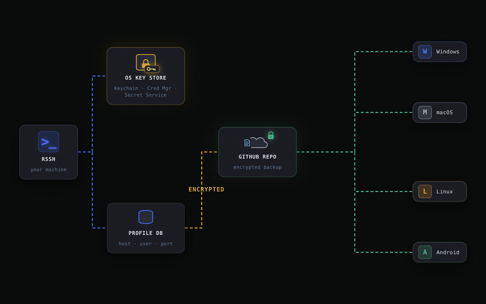
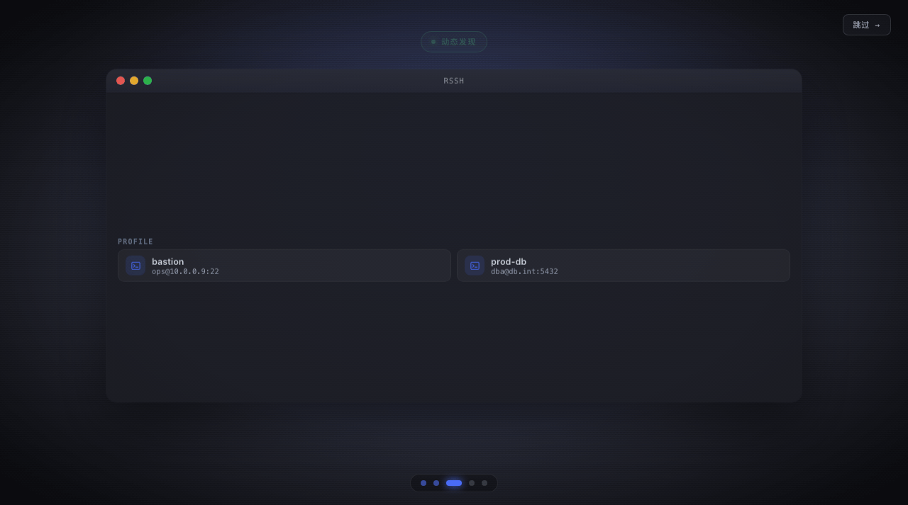

# 传统 SSH 工具的五宗罪

SSH 协议 1995 年发布。协议本身挑不出大毛病 —— OpenSSH 到今天仍是安全工程的教科书。烂的是包在协议外面那层工具：三十年过去，几个历史错误不但没被修正，还被经营成了"传统"。

这不是吐槽 UI 品味。UI 可以各有所爱，这五宗罪全是结构性的：错误的抽象、错误的信任模型、错误的数据归属。每一宗背后都站着一个错误的默认假设：

1. AI 与终端之间，人当搬运工天经地义
2. 终端输出是字节流，只是一个字节流渲染器
3. 想要现代体验，就得把密钥交出去
4. 一台机器等价于一个 IP
5. 你的数据，其实是工具的数据

一条条审。

---

## 第一宗罪：让人给 AI 当搬运工

**罪状。**

2026 年了，"AI 排障"的主流姿势还是这样：

```text
终端里跑命令 → 肉眼看输出
  → 切到浏览器，复制，粘贴给 AI
  → AI 回一条命令 → 复制，切回终端，粘贴，回车
  → 输出再复制回 AI → ……
```

人站在 LLM 和终端中间，干的是数据线的活。这个循环还顺手外送三样东西：

- token、密码、内网 IP 原样外发，没人替你脱敏
- ANSI 转义、宽字符、进度条刷屏，粘进网页全是垃圾
- 上下文一长触发截断，前几步的诊断全丢

**病根。**

AI 和终端是两个世界，唯一的通道是剪贴板。剪贴板不认识命令、不认识输出边界、更不负责脱敏 —— 它只是个字节搬运槽。

而 SSH 客户端本来就在所有命令的 I/O 中间 —— 每个字节进出都从它手上过。只有它能做的事，三十年没人做。

**rssh 的改法。**



给 LLM 四个工具，让它自己驱动诊断，人只做裁决：

```text
run_command(cmd, explain, side_effect, timeout_s?)
download_file(remote_path, max_mb)
analyze_locally(local_path, task)
load_skill(id)
```

每条命令以卡片形式出现：命令本体、一句人话解释、明确的副作用声明（跑 `jmap -histo:live` 就得标注 "triggers a Full GC"），以及 Approve / Reject。你点了同意，命令才被粘进你的活动终端执行 —— 在你自己的交互终端里，完整可见，没有后端注入。退出码靠 sentinel 回显拿回（`cmd; echo "<uuid>:$?"`），输出自动切片、脱敏、截断后回给 LLM。

安全不靠 prompt 自律，四道墙全部在 Rust 里 enforce：结构校验拦截危险命令、每条命令人工确认、payload 离机前本地脱敏、GB 级输出截断 + 大文件转本地分析。

人从搬运工变成审批人。这才是 2026 年该有的分工。

---

## 第二宗罪：四十年了，终端还是个字节渲染器

**罪状。**

`\x1b[31mHello\x1b[0m\r\n` 进来，渲染一个红色的 Hello，完事。谁说的"红色"？这是哪条命令的输出？从哪行开始、到哪行结束？终端不知道 —— **它只知道字节。**

于是日常操作全变成考古：

- 想复制上一条命令的输出：滚轮往上滚，肉眼找起点
- 粘进 GitHub issue：拖出一屏 ANSI 转义和软换行
- 想问 AI"这是什么错"：能递过去的只有整屏字节
- 想审计昨天跑了什么：没有"命令"这个单位，只有 scrollback

**病根。**

抽象选错了。四十年来终端的对外接口就是 byte 渲染器，"一条命令"从来不是对象。第一宗罪里 AI 只能吃字节垃圾，病根一半在这儿 —— 连人都切不准边界的东西，就别指望 LLM 了。

有终端想修这个问题，路子是在服务器上装 shell 集成脚本。可堡垒机后面的机器没有 sudo，客户的救火机器不许污染 dotfile，`kubectl exec` 进的 pod 里根本没有你的脚本，一万台机器挨个装一遍？这不是答案，这是把病灶挪了个位置。

**rssh 的改法。**



客户端自己切，零服务器改动：用户按 Enter，记一个 marker；下一次 Enter，前一块收尾、新一块开张。两个端点用 xterm.js 的 `IMarker`，跟着 scrollback 自动迁移、resize 无感知 —— 核心实现 117 行。

关键在于这一刀切出来的是**对象**：`block.start..block.end`。然后能力自己长出来：

- **复制为文本**：这段 cell 丢掉 ANSI、合并软换行，贴出来直接可用
- **复制为图片**：同一份切片交给 canvas 重画，颜色、粗体、CJK 宽字符都在
- **折叠**：把这段 buffer 真的 splice 出去 —— 不是 CSS 骗 UI、不骗 buffer
- **AI 执行**：sentinel 之前那段就是这条命令的输出，天然就是块
- **审计**：以块为单位记录，读起来是意图，不是 12KB 的 ANSI

---

## 第三宗罪：想要点现代体验，就得交出私钥

**罪状。**

OpenSSH 本身没这个问题 —— 密钥躺在 `~/.ssh/`，谁也拿不走。问题是 2026 年你对"好用"有了合理期待：图形界面、多端同步、手机上也能连。主流的答案是：注册个账号，把私钥、密码、passphrase 上传到厂商服务器，然后向你保证"端到端加密，放心"。

你怎么验证？客户端是闭源二进制，服务端的存储格式你看不到。厂商被攻破的那天，全网用户的 SSH 凭据一起裸奔 —— 这不需要想象，先例都在新闻里。

订阅费在替你买什么？买一个额外的攻击面。本来你的私钥只在你自己的 `~/.ssh/`，现在多了一份在别人的存储桶里。

**病根。**

行业的隐含假设：**要同步，就必须有个中心节点替你保管数据。** 这个假设是错的。保管和同步是两件事，被捆在一起卖了十几年。

**rssh 的改法。**



拆开。

- **保管**：密码、私钥 passphrase 进操作系统的钥匙串 —— macOS Keychain、Windows Credential Manager、Linux Secret Service。rssh 进程不持有长期密钥，用一次向钥匙串要一次；passphrase 缓存用 `Zeroizing` 包装，Drop 时显式抹零
- **同步**：profile、转发规则、片段加密后推到**你自己的** GitHub 私有仓库或 WebDAV 服务 —— 不是 rssh 的服务器，rssh 压根没有服务器
- **私钥默认不上云**：每条凭据独立的 `save_to_remote` 开关，默认关。私钥十年不变，U 盘拷一次就够；真想推，旋钮在你手里

加密实现 100 行（`src-tauri/src/crypto.rs`）：Argon2id 派生密钥（19 MiB / 2 迭代，OWASP 基线），ChaCha20-Poly1305 认证加密，参数钉死成常量。GitHub 拿到的只是密文 —— 没有你的密码，解不开。

哪天你不想用 rssh 了，备份文件就在你自己的 repo 里，wire format 写在源码注释里。没有锁定，因为从来没有锁。

---

## 第四宗罪：拿静态 IP 硬套弹性的世界

**罪状。**

传统客户端的核心模型是 1990 年代的：新建 Profile → 填 host、port、username → 保存 → 下次从列表点开。

这套模型假设机器是稳定的、少量的、长期存在的。今天的现实：

- Docker 里今天 12 个容器，明天名字和 ID 全变
- Kubernetes 滚动发布，Pod 重建一次 IP 换一次
- 一台笔记本上挂着多个 docker context、多个 kube context
- 云上弹性伸缩，内网 IP 是个临时属性

这时候还让人手工维护"IP → 机器"清单，等于拿纸质地图导航高速公路：清单永远过期，死配置越堆越多，真正重要的长期连接反而被淹没。

**病根。**

把"连接目标"建模成了静态地址。但今天你要进的目标 —— 容器、Pod、云资源 —— 是**身份**，不是地址。地址是易变的实现细节，身份才稳定。数据结构停在 1995，世界早就弹性了。

**rssh 的改法。**



动态发现，两条原则：

**一、发现身份，不记录 IP。** rssh 复用你本机的 `docker` / `kubectl` CLI context 发现正在运行的容器和 Pod —— 不发明新的探测协议，不在任何服务器上装 agent，不绕过你已经配好的认证链路。Home 里出现的是"这个 context 下现在活着的目标"：容器重启，旧目标消失；新容器起来，新目标出现。没有死配置需要清理。

**二、发现结果不是配置。** rssh 只持久化"发现来源"（platform + context + namespace），不持久化发现结果。动态目标不进 Profile 数据库，也不能收藏 —— 收藏一个会消失的 Pod 没有意义。打开时产出 `docker exec -it` / `kubectl exec -it` 的 connector，和静态 Profile、Forward 平级躺在同一个列表里，走同一套搜索和打开逻辑。

配置稳定的是入口，变化的是结果。这才对得起"弹性"两个字。

---

## 第五宗罪：专有格式圈地，数据不让你带走

**罪状。**

打开主流 SSH 工具，你被一圈围墙包围：

- 自管一套 host key 数据库 —— 命令行 `ssh` 信任过的主机，到 GUI 里要再确认一次；同一个事实，两份真理
- 会话录制是私有格式，只能用它自家的播放器打开
- 连接数据锁死在 GUI 里。想在 tmux、CI、同事的终端里用？没有出口，顶多赏你一个"导出 CSV"

**病根。**

不是技术做不到，是商业模式不允许。数据彻底互通的那天，就是你换工具零成本的那天。专有格式不是功能缺陷，是精心设计的退出成本。

**rssh 的改法。**

能标准的全标准，能共用的全共用：

- host key 直接读写系统的 `~/.ssh/known_hosts`，和命令行 `ssh` 一份数据
- 主机配置可从 `~/.ssh/config` 导入
- CLI 和 GUI 读同一个 SQLite（`~/.rssh/rssh.db`）：GUI 里维护 profile，`rssh profile open foo` 直接在你的 tmux 里连上；alias、Makefile、CI 随便写
- JetBrains 插件与桌面版共享同一个 `~/.rssh` —— IDE 工具窗口里就是同一套主机、密钥、设置
- 会话录制用 asciicast v2（asciinema 的开放格式），任何支持它的播放器都能放
- 同步备份就是你自己 repo 里的一个加密文件，wire format 写在源码注释里

工具不拥有你的数据，只是借用。你随时可以走 —— 这是设计目标，不是缺陷。

---

## 判决

五宗罪表面是五个功能问题，往下挖是同一个病：**工具站在你和服务器中间收过路费。**

| 宗罪 | 错误的默认假设 | rssh 的做法 |
|---|---|---|
| 人当搬运工 | AI 与终端只能靠剪贴板 | AI 内置在 I/O 中间，四道墙，人只审批 |
| 只有字节 | 输出是字节流，不是对象 | Enter 一刀切出命令块，能力自然生长 |
| 交出私钥 | 同步 = 中心节点保管 | 钥匙串 + 你自己的 repo，无服务器 |
| 认死 IP | 目标 = 静态地址 | 动态发现，目标是身份不是地址 |
| 格式圈地 | 数据归工具所有 | known_hosts / asciicast / 同一个 SQLite |

rssh 的全部设计就是把这五个假设逐个反过来：AI 在 I/O 中间跑腿、你只审批；字节流之上切出命令对象；秘密进你的钥匙串、配置进你的 repo；动态目标实时发现；数据格式全部开放。

**一句话**：好的 SSH 工具应该让你忘记它的存在，而不是让你天天伺候它。
